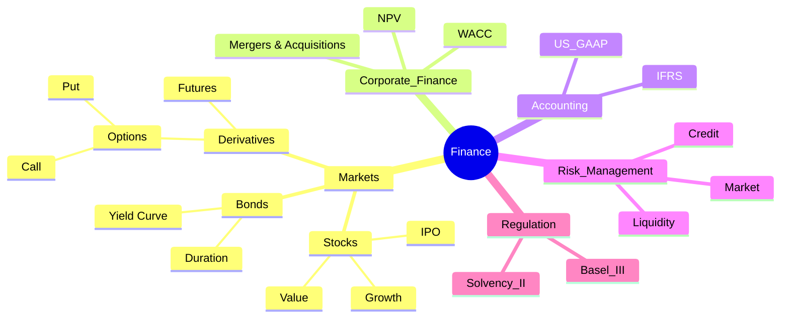

# 5 steps to create, preview and export a Mermaid diagram

## 1. Create a Markdown file with a Mermaid block

Open a file `file.md` in VS Code and write for example:

```markdown
# Finance Mindmap



**Important**: Include the ```` ```mermaid ```` tags at the start and ```` ``` ```` at the end.


## 2. Preview inside VS Code

- Install the **Markdown Preview Mermaid Support** or **vscode-mermaid-preview** extension.  
- Open Markdown preview with `Cmd+Shift+V` (Mac) or `Ctrl+Shift+V` (Windows/Linux).  
- You see the Mermaid rendering live.

## 3. Extract Mermaid code to a `.mmd` file (for CLI)

To use `mmdc` (Mermaid CLI), you need a `.mmd` file **without** the ```` ```mermaid ```` tags.

You can use this simple bash script:

```bash
#!/bin/bash
# extract_mermaid.sh
if [ $# -ne 2 ]; then
  echo "Usage: $0 input.md output.mmd"
  exit 1
fi

sed -n '/^```mermaid$/,/^```$/p' "$1" | sed '1d;$d' > "$2"
echo "Extraction complete: $2 created."
```

Save it, make it executable:

```bash
chmod +x extract_mermaid.sh
```

Then run:

```bash
./extract_mermaid.sh file.md file.mmd
```

## 4. Generate an SVG with Mermaid CLI

Make sure `mmdc` is installed (first install Node.js).

To generate SVG:

```bash
mmdc -i file.mmd -o file.svg
```

## 5. View the SVG

- On Mac, open directly with:

```bash
open file.svg
```

- Or in VS Code, simply open the SVG file.

***<p style="text-align:center;">There you go!</p>***
***<p style="text-align:right;">𝒫𝑜𝒾𝓃𝒦</p>***